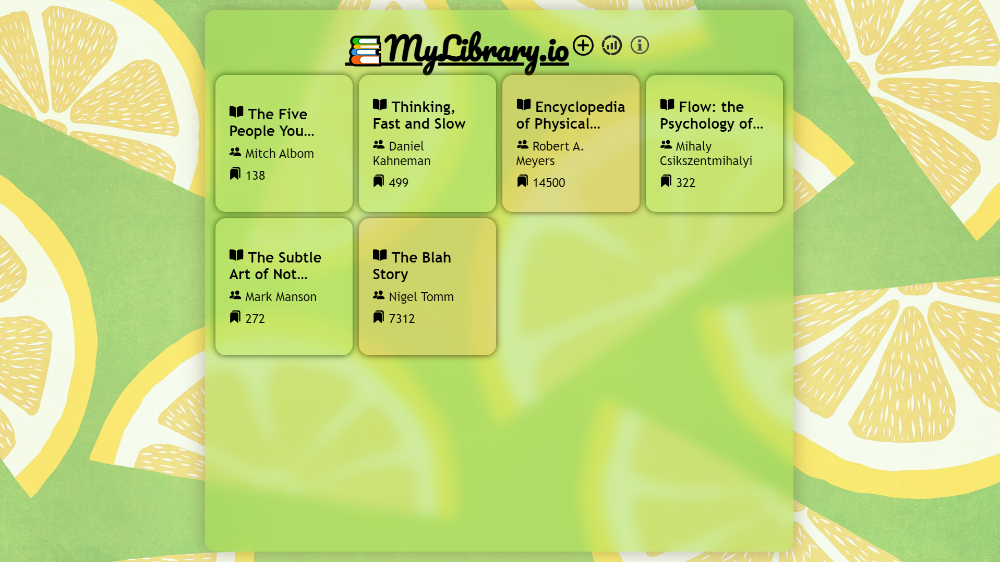

# JavaScript Library

### Project Overview

- Web app written to practice Vanilla JavaScript.
- Record the books read using the app.
- Display statistics on books tracked.
- Illustration  
   
- Demo run:

### Image Credits

[1] [plus.png](https://www.pngwing.com/en/search?q=plus+Icon)  
[2] [info.png](https://www.pngfind.com/mpng/imhbxoR_infobox-info-icon-info-icon-svg-hd-png/)  
[3] [stats.png](https://www.freeiconspng.com/images/statistic-icon)
